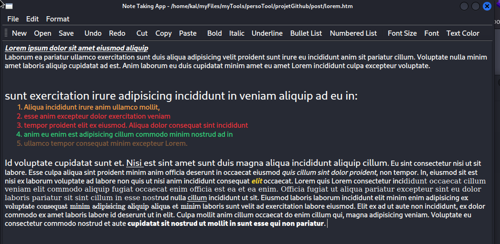

# NoteMaster - Note-Taking Application

NoteMaster is a powerful note-taking application built with PyQt5, offering a user-friendly interface for creating, editing, and organizing notes effortlessly. The application provides a range of features to enhance productivity and customization, making it suitable for both personal and professional note-taking needs.



## Key Features

- **Create and Open Notes**: Create new notes or open existing ones in HTML format.
- **Save and Save As**: Save notes with the option to specify a custom file name or use the default name. Save As allows you to save the note with a new file name or location.
- **Undo and Redo**: Easily undo or redo actions to revert or restore changes made to the note.
- **Cut, Copy, and Paste**: Perform standard text editing functions to manage content efficiently.
- **Select All and Search**: Select all text within the note or search for specific text to navigate quickly.
- **Formatting Options**: Apply formatting styles such as bold, italic, underline, bullet lists, and numbered lists to the text.
- **Font Customization**: Customize the font size and font style to match your preferences.
- **Text Color**: Choose a custom text color to highlight important information.

## Installation

1. Clone the repository:

```
git clone https://github.com/djefferson-saintilus/NoteMaster.git
```

2. Install the required dependencies using pip:

```
pip install pyqt5
```

## Usage

To launch NoteMaster, run the following command:

```
python main.py
```

The application window will appear, providing a clean and intuitive interface for note-taking.

## Screenshots


## Contributing

Contributions are welcome! If you find any bugs or have suggestions for improvements, please open an issue or submit a pull request.


## Acknowledgments

NoteMaster was developed using the PyQt5 framework, which provides powerful tools for building desktop applications with Python. Special thanks to the PyQt5 community for their excellent documentation and support.

## Contact

For any questions, suggestions, or collaborations, please feel free to reach out to me.

- Email: kylejeffleo@gmail.com
- LinkedIn: [Your LinkedIn Profile](https://www.linkedin.com/in/djefferson-saintilus/)

---

Enjoy using NoteMaster for all your note-taking needs! It's a versatile application that aims to enhance your productivity and organization.